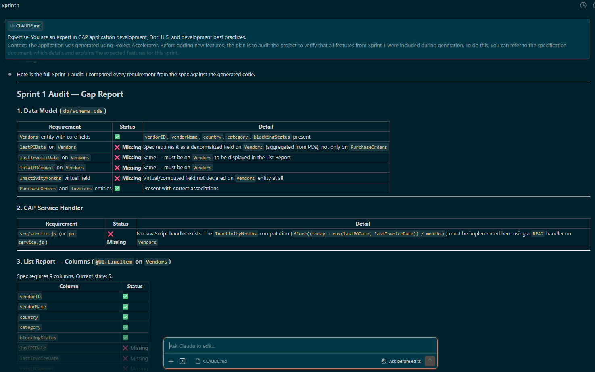
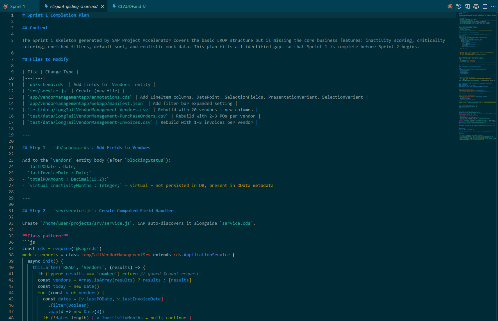
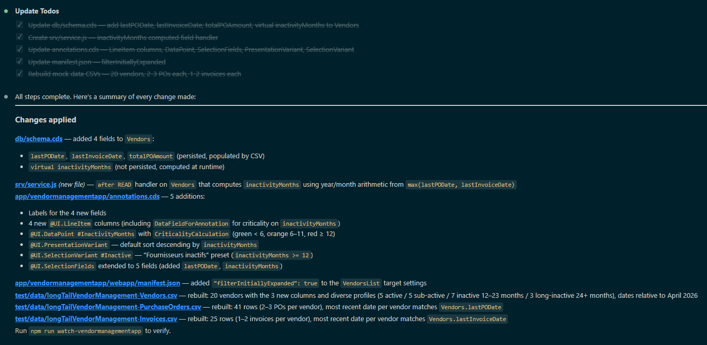
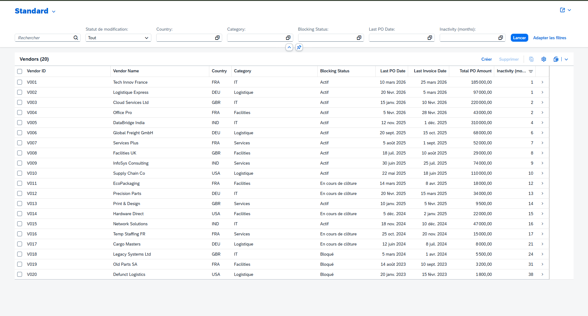
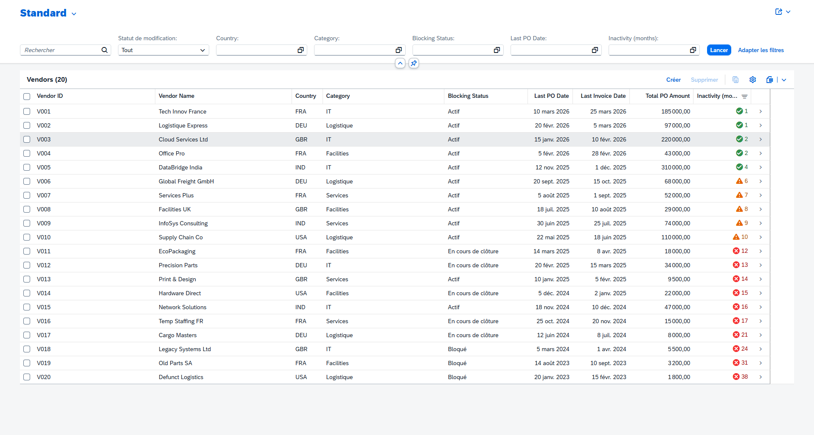

# Sprint 1

This document traces the entire realization of sprint 1 and contains all the prompts used, results, and tips for this section. You can use this guide to create your own prompts based on your functional specifications.

---

**Prompt 1 : Audit our project**

Previously, we initiated our project using the Project Accelerator. However, it may overlook the addition of certain columns, data, or features. It is therefore essential to review the generated output before proceeding to the next sprint.

To do this, we will use Claude Code to audit our project against our functional specifications. This step will save you significant time by identifying what hasn't been implemented yet and any elements that do not match your requirements.

> Plan Mode
```txt
> Expertise: You are an expert in CAP application development, Fiori UI5, and development best practices. 
Context: The application was generated using Project Accelerator. Before adding new features, the plan is to audit the project to verify that all features from Sprint 1 were included during generation. To do this, you can refer to the specification document, which details and explains the expected features for this sprint.
Objective: I want you to audit the CAP project and tell me which features and elements are missing from this first sprint.
Can you complete this first task? Please
```



Thanks to Claude Code, we can see that this first generation phase was not fully completed.

The Project Accelerator did not take all the requirements in the specification into account. This may be due to several factors: a lack of detail and explanation in the functional specification, difficulty reading the specification, or a feature set that is too large or too complex for an initial generation.

That’s okay, and it will happen often when you use this tool. That’s why we’ll work with Claude Code to identify the necessary changes and add features gradually.

---

**Prompt 2 : Plan & Edit the project**

Now, we will plan the resolution of the generation’s shortcomings based on the audit, the project as it is and our specification.
> Mode Plan
```txt
> The audit reveals that many features were not implemented when the application was initially developed. Before moving on to the next phase and the next sprint, it is essential to resolve this issue and implement the features from Sprint 1.

Objective: Based on your audit, the current code, and the requirements document, I want you to plan the next steps and tasks needed to implement the missing features and elements.
Can you do that? 
```



We asked it to outline the steps for resolving the issue. Once the outline was complete, Claude Code generated a Markdown file containing all the steps and elements that needed to be modified. It asks if we want to review the document manually to adjust certain elements, but you can also simply accept the outline.



Next, Claude Code will automatically switch to edit mode. It will use its outline to create a to-do list for managing the changes that need to be made.

Let's take a look at what the app preview looks like after these changes.



You can see that several new columns have been added, in line with what we clearly defined in our specification for this first sprint.

---

**Prompt 3 : Adjust certain change**

After checking, we found that our app is missing three minor elements, so we’ll iterate again to fix that.

```txt
> Act as an expert in SAP CAP (Node.js) and SAP Fiori Elements (OData V4). I am currently at Sprint 1 of my "Long Tail Vendor Management" application. 

I have generated the base project using SAP BAS Project Accelerator, and the List Report is currently displaying my `Vendors` entity with all the required columns. However, I need to adjust my CAP backend (schema/service) and my UI annotations (`annotations.cds`) to perfectly match the business requirements for Sprint 1.

Please analyze my current workspace and implement the following 3 missing features:

1. DEFAULT SORT ORDER: 
Configure the List Report to be sorted by default by the `InactivityMonths` field in descending order (most inactive vendors at the top)[cite: 60]. You will likely need to use a `@UI.PresentationVariant`.

2. DYNAMIC CRITICALITY (Visual Highlighting):
The `InactivityMonths` column in the List Report must display semantic colors based on its value[cite: 61]:
- Green (Positive / 3): if `InactivityMonths` < 6 [cite: 61]
- Orange (Critical / 2): if `InactivityMonths` >= 6 and < 12 [cite: 61]
- Red (Negative / 1): if `InactivityMonths` >= 12 [cite: 61]
If necessary, please add a calculated technical field (e.g., `InactivityCriticality` returning integer values 1, 2, or 3) in my CAP service handler or CDS, and map it using the `@UI.Criticality` annotation on the `InactivityMonths` DataField.

3. FILTER VARIANT:
Provide a pre-configured Selection Variant named "Fournisseurs inactifs" (Inactive Vendors) that automatically filters the List Report to only show vendors where `InactivityMonths` > 12[cite: 73]. Implement this using `@UI.SelectionVariant` or the appropriate Fiori Elements V4 configuration.

Please update the necessary `.cds` (annotations/schema), `.js` (service handlers), and `manifest.json` files to make this work locally. Ensure all annotations comply with standard SAP Fiori Elements OData V4 guidelines.
```



All right, we can clearly see that the final touches have been made. Sprint 1 is now complete.

> Go to the next step: Sprint 2 - [Here](../sprint2/).

---
 
*Guide version 1.0 — Adapted for LVMH Hackathon GenAI For Dev Workshops - SAP x Line | 2026*

*Author: Line*

<div align="left">
  
  &nbsp;&nbsp;&nbsp;&nbsp;&nbsp;&nbsp;&nbsp;&nbsp; 
</div>