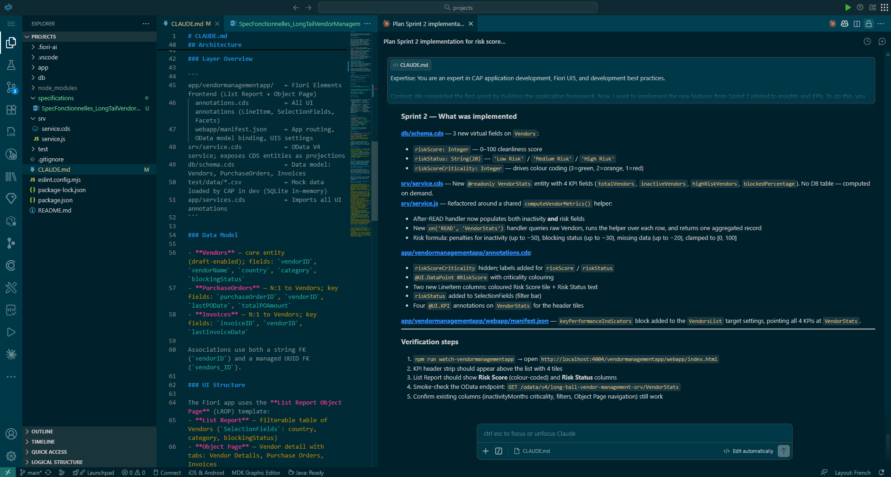
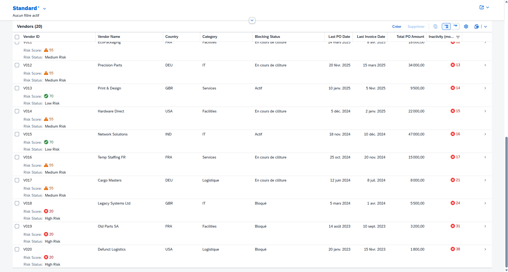
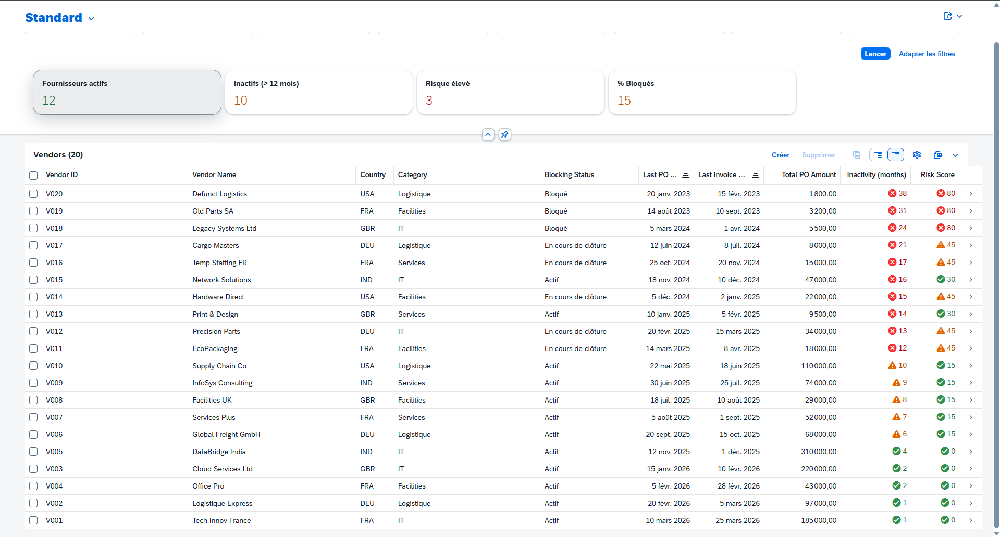

# Sprint 2

This document traces the entire realization of sprint 2 and contains all the prompts used, results, and tips for this section. You can use this guide to create your own prompts based on your functional specifications.

> [!NOTE]
> As a reminder, in the serious game and hands-on exercise, you must define the sprints progressively to align with the incremental development of features (in the functionnal specifications). This way, Claude Code won’t get “lost” in the mountain of features and will stay focused on.

---

**Prompt 1 : Plan & Edit the project**

We have an initial version of the app that currently displays a list of our salespeople, along with detailed information and display settings. We will now move on to the next sprint.

Starting with this step and for the remaining sprints, we will systematically specify that we have moved on to the next sprint (here, Sprint 2) and that the previous sprints have been tested and validated (here, Sprint 1 only).
You may want to add this line to the Claude.md file and specify it at the start of each session.

Let's open a new session ("new chat") to begin the planification for Sprint 2 and implementing the features.

As with Sprint 1, let’s ask Claude to review the specifications and plan the changes. However, in this case, we’ll specify the project status (Sprint 1 > Sprint 2)

> [!WARNING]
> This sprint may be the most challenging to implement because you’ll likely need to add KPI headers and deviate from the standard Fiori Element template. Implementing customizations can be more difficult than working with the data itself. But if you provide detailed prompts and write clear specifications, Claude should be able to handle it just fine.

> Plan Mode Selected
```txt
> Expertise: You are an expert in CAP application development, Fiori UI5, and development best practices.
Context: We completed the first sprint by building the application framework. Now, I want to implement the new features from Sprint 2 related to insights and KPIs. To do this, you can refer to the specification document, which details and explains the expected features for this sprint.
As a reminder, the two main features are:
1. Risk Score & Status: Add a calculated RiskScore (0-100) and RiskStatus to the List Report.
2. KPI Header: Add a Header Facet above the List Report displaying aggregated metrics (Total vendors, Inactives, High Risk, % Blocked).
Requirements: Any changes made during this sprint must not, under any circumstances, break existing functionality. Additionally, you must follow best practices for CAP, Fiori, and UI5 development.
Objective: I want you to step-by-step plan the implementation of all Sprint 2 features. Please detail which files need to be modified (db/schema.cds, srv/service.js, app/.../annotations.cds, etc)  and how you intend to implement the logic before writing the actual code.
```

**Result of the first iteration:** 



**Continue to iterate to display the KPI header :**



---

**Prompt 2 : Resolve errors and shortcomings**

We can see that Claude Code has implemented numerous features in this iteration. Scores and statuses are in place.
However, we also see that many elements are missing: 
1. A reversal of the risk logic
2. No KPI header
3. Default sorting

We're going to ask him to make some changes to refine it. 

```txt
> We are iterating on Sprint 2 (Insights & KPIs). Based on the latest UI review, some progress has been made (e.g., Risk Score is now a separate column, and the filter bar is active). However, several key specifications from Sprint 2 are still either incorrect or completely missing.
Here are the specific issues that need to be fixed to complete Sprint 2:

Criticality Logic Inversion: The RiskScore criticality colors are reversed. According to the specs, a high score represents a high risk (bad). 0-30 = Low/Green (@Positive), 31-60 = Moderate/Orange (@Critical), 61-100 = High/Red (@VeryNegative). Currently, the UI shows a score of 100 as green and 20 as red.

Missing Risk Status Column: The RiskStatus field (text values: Faible, Modéré, Élevé) is missing from the table columns (@UI.LineItem). It needs to be displayed alongside the Risk Score.

Missing KPI Header: The Header Facet above the List Report is still completely missing. We need to implement the header using @UI.KPIAnnotation or @UI.DataPoint to display the 4 required aggregated metrics:
- Total active vendors
- Inactive vendors (InactivityMonths >= 12)
- High Risk vendors (RiskStatus = Elevé)
- Percentage of Blocked vendors

Default Sorting: The table is currently sorted by InactivityMonths ascending. The specifications strictly require it to be sorted by InactivityMonths DESCENDING by default.

Requirements: Any changes made during this sprint must not, under any circumstances, break existing functionality. Additionally, you must follow best practices for CAP (Node.js handlers for KPI aggregations if necessary) and Fiori Elements (UI5 annotations).

Objective: I want you to step-by-step plan the implementation to fix these 4 specific issues. Please detail exactly which files need to be modified (e.g., srv/po-service.js for backend logic, srv/annotations/annotations.cds for UI) and how you intend to implement the logic before writing the actual code.
```

The risks and logic have indeed been modified. The sorting is also correct for inactivity. However, the header still doesn't appear. We're going to focus on adding this header; it's the critical and complex part for Claude Code.

---

**Prompt 3 : Solve the problem of KPIs**

We're going to try to fix this bug in the KPI header. Everything else is working except for this feature, and the app launches correctly. We're not going to roll back the changes, but we'll continue to iterate on this feature and have Claude Code focus on it.

To help guide Claude, we’re providing more technical details. To do this, you can consult Claude, Gemini, or another tool to help you create this prompt.

```txt
> We applied your previous changes. The sorting and criticality logic are now correct. However, we still have a major UI issue that do not match the Sprint 2 specifications.

KPI Header Issue: The Header Facet with the KPIs is STILL not visible on the screen. The space above the table is completely empty. Although you added @UI.KPI annotations, they are not rendering in Fiori Elements OData V4.

Requirements & Action Plan:
Fixing KPIs (OData V4 specific): Since standard @UI.KPI annotations often fail to render without complex manifest.json routing in V4, please implement the header metrics using standard @UI.HeaderFacets.

Create a @UI.FieldGroup or individual @UI.DataPoint annotations for the 4 metrics (Total active, Inactives, High Risk, % Blocked).

Bind them to the @UI.HeaderFacets of the List Report page (or Object Page if List Report header is unsupported without manifest changes, but try to place them at the top of the List Report).

Hint: If placing them in the List Report header via CDS annotations is not natively supported without modifying manifest.json settings (like controlConfiguration), please provide the exact manifest.json code needed to display these DataPoints in the List Report header.

Objective: I want you to fix this KPI header so that it appears in the report list in the app.
Can you fix this bug, please?
```

---

**Prompt 4-N : Continue to iterate to display the KPI header**

```txt
> The KPI header is still not displaying.
Here are the console errors: "//HERE: Copy and paste the errors into the console."

Can you fix this issue with the KPI display, please?
```

If it doesn't work (which is what happened to me), keep trying and provide the relevant console errors.

If it doesn't work and the app crashes because of the changes, don't hesitate to revert them.

> [!IMPORTANT]
> It's essential that you version your project so you don't lose everything you've worked on since the beginning.

Finally, after some iteration (3 or 4), the header is displayed correctly and the values are accurate.


> Go to the next step: Sprint 3 - [Here](../sprint3/)

---
 
*Guide version 1.0 — Adapted for LVMH Hackathon GenAI For Dev Workshops - SAP x Line | 2026*

*Author: Line*

<div align="left">
  
  &nbsp;&nbsp;&nbsp;&nbsp;&nbsp;&nbsp;&nbsp;&nbsp; 
</div>