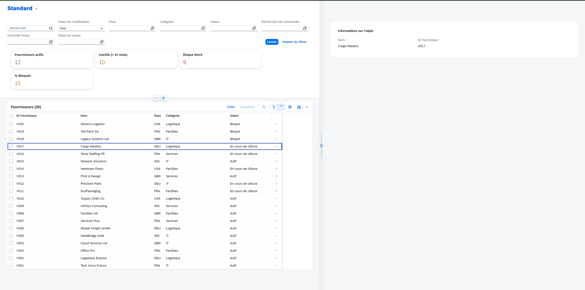
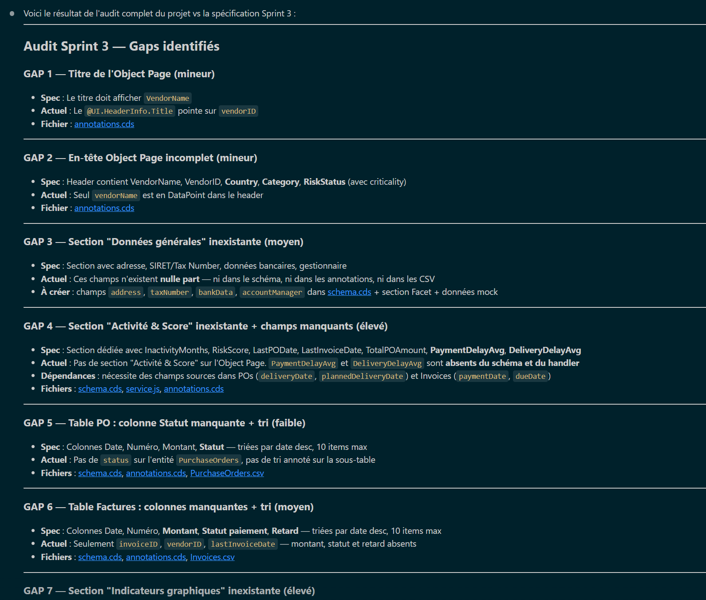
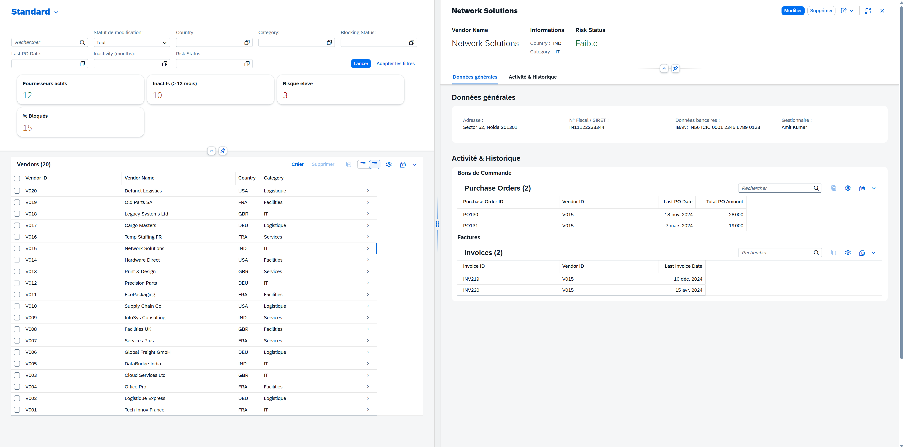
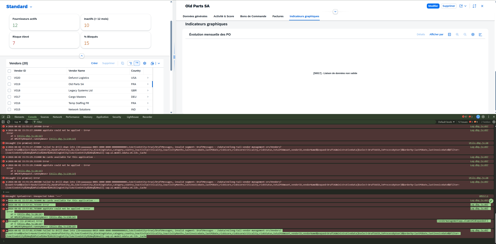
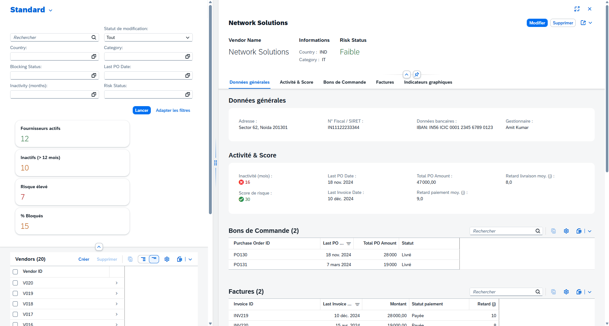
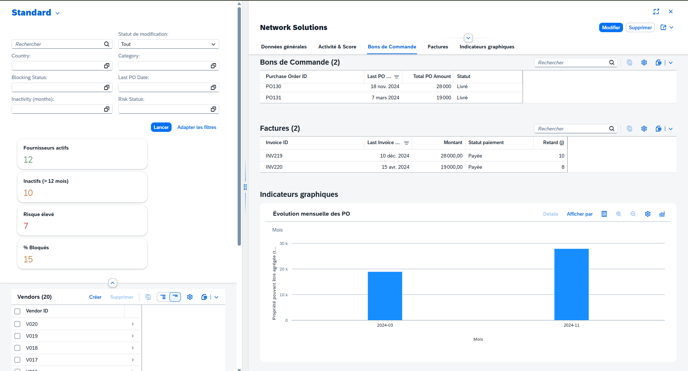

# Sprint 3

This document traces the entire realization of sprint 2 and contains all the prompts used, results, and tips for this section. You can use this guide to create your own prompts based on your functional specifications.

> [!NOTE]
> As a reminder, in the serious game and hands-on exercise, you must define the sprints progressively to align with the incremental development of features (in the functionnal specifications). This way, Claude Code won’t get “lost” in the mountain of features and will stay focused on.

---

**Prompt 1 : Plan & Edit the project**

To continue our progress, we move on to sprint 3 which will focus on navigation and the addition of elements, graphs, indicators in the object page.

As previously, we use the same prompt format in plan view to maximize feature additions in this first iteration of Claude Code.

> Plan Mode Selected
```txt
> Expertise: You are an expert in CAP application development, Fiori UI5, and development best practices.
Context: We completed the first and second sprint by building the application. Now, I want to implement the new features from Sprint 3 related to navigation & Object Page. To do this, you can refer to the specification document, which details and explains the expected features for this sprint.

As a reminder, the main features for Sprint 3 are:
1. Navigation: Enable line-item navigation from the List Report so the user can click on any vendor row to access their specific Object Page (route: /Vendors/{VendorID}). The Object Page title must dynamically display the VendorName.

2. Object Page Structure & Facets: Build a comprehensive detail page structured with the following sections:
- Header: Display VendorName, VendorID, Country, Category, and RiskStatus (with criticality color).
- General Data (Données générales): Basic information including Address, SIRET/Tax Number, Bank details, and Manager.
- Activity & Score (Activité & Score): Key metrics including InactivityMonths, RiskScore, LastPODate, LastInvoiceDate, TotalPOAmount, PaymentDelayAvg, and DeliveryDelayAvg.
- PO History (Historique des PO): A table displaying the 10 most recent Purchase Orders (Date, Number, Amount, Status), sorted by date descending.
- Invoice History (Historique des Factures): A table displaying the 10 most recent Invoices (Date, Number, Amount, Payment status, Delay), sorted by date descending.
- Graphical Indicators (Indicateurs graphiques): A Bar Chart (@UI.Chart) showing the monthly PO amount evolution over the last 12 months.

3. UI/UX Rules: Ensure the Object Page follows the standard Fiori Elements layout (2 columns on desktop, 1 on mobile). Any missing values must display a "N/A" placeholder.

Also, some of these features can already be achieved via the initialization of the project (e.g.: there is already an object page)

Requirements: Any changes made during this sprint must not, under any circumstances, break existing functionality. Additionally, you must follow best practices for CAP, Fiori, and UI5 development.

Objective: I want you to step-by-step plan the implementation of all Sprint 3 features. Please detail which files need to be modified (db/schema.cds, srv/service.js, app/.../annotations.cds, etc)  and how you intend to implement the logic before writing the actual code.
```




**Prompt 2 : Restart from the begining**

We can see that Claude Code redefine all Object Page based on the functionnal specification. Howerver, with the project accelerator, the object page already has been deifne with relevant struture and information.

So, let's revert changes and we are going to change our way of doing things. We will proceed in the same way as for sprint 1. Given that we already have content meeting the basis of our request. We will ask Claude Code to audit the code. 

```txt
> Expertise: You are an expert in CAP application development, Fiori UI5, and development best practices. 
Context: The application was generated using Project Accelerator and I performed iterations to add content. We are at sprint 3, with sprint 1 and 2 validated. Before adding the features of sprint 3, the goal is to audit the project as it stands. Indeed, the project was initialized with an Object Page already properly formatted and we want to keep the current elements while adding the missing elements in comparison with the functional specification (sprint 3). 

Objective: I want you to audit the CAP project and tell me what features and elements are missing from this sprint 3.
Can you complete this first task? Please
```



So after that, we saw that Claude Code has analysed the project anbd the sprint correctly. So now, we will iterate on the different gap to be more precise.

With this way, we can check on each gap (step) and valide or iterate on it.

```txt
> Let’s do gap by gap, in iterative please.
```

After the gap 1, 2 and 3, we can see that Claude Code is better and very precise.


> [!TIP]
> So, with this example, we can say that for complexe et hudge demand and features, we need to split it in several gap and step. And, you can use Claude Code to defie and plan the step-by-step process.

---



As before, adding charts, KPIs, etc. are always more complex to set up. It is necessary to iterate several times, giving him as much explanation as possible about the current behavior of the application and the errors in the console so that he can know what he needs to correct. It should (normally) converge towards the right solution and way of doing things.

Following this audit, we have iterated on each Gap for those added to the application. 

> [!NOTE]
> Noted that the graphic part, gap 7, was the most complex to set up. A lot of error, a lot of iteration, but Claude Code managed to converge towards an interesting and functional result. However, we used other AI tools (Gemini) to guide us on technical topics, understanding errors and hypotheses.

**Final Outcome:**





> Go to the next step: Sprint 4 - [Here](../sprint4/).

---
 
*Guide version 1.0 — Adapted for LVMH Hackathon GenAI For Dev Workshops - SAP x Line | 2026*

*Author: Line*