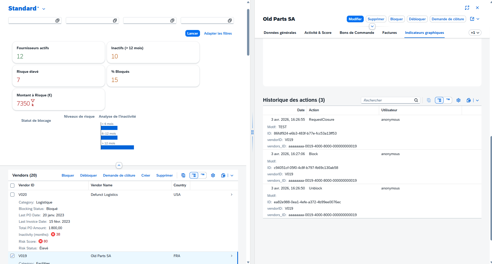
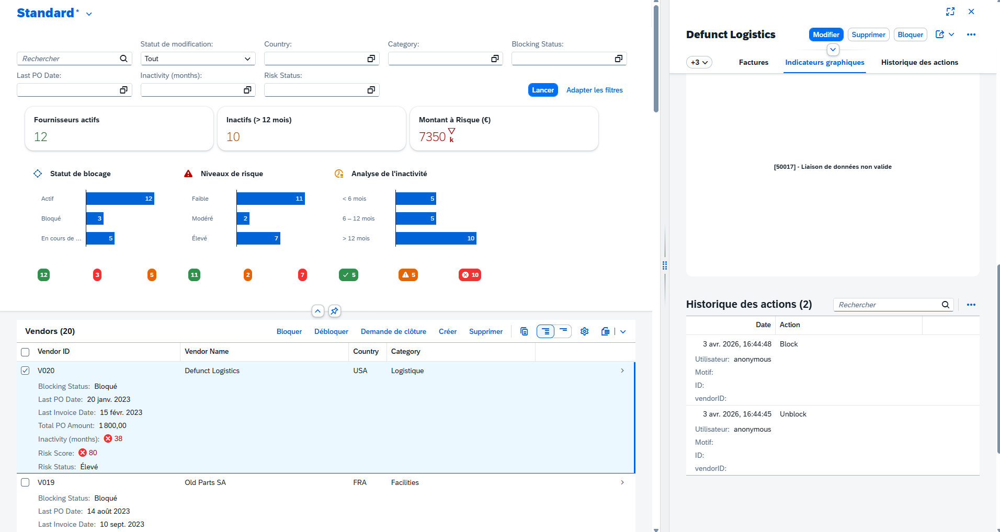
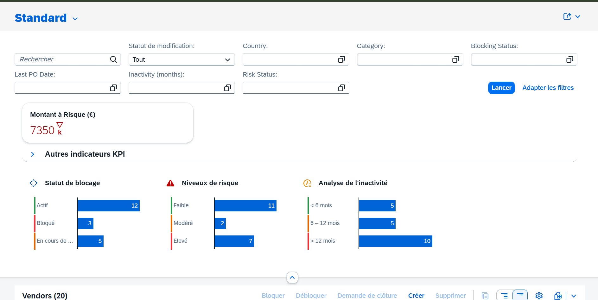
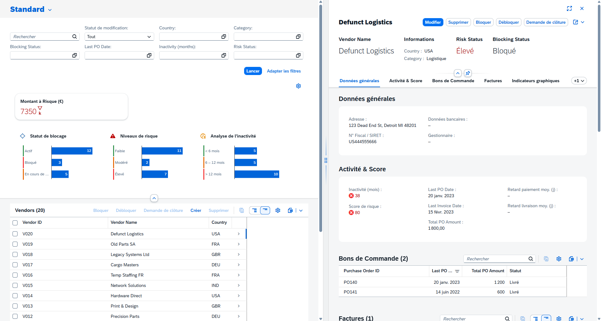

# Sprint 4

This document traces the entire realization of sprint 2 and contains all the prompts used, results, and tips for this section. You can use this guide to create your own prompts based on your functional specifications.

---

**Prompt 1 : Plan & Edit the project**



**Prompt 3 : Adjustments and Resolutions**



**Prompt 4 : Adjustments and Resolutions**

**Prompt 4 : Adjustments KIPs**
We can note that all the features around the KPIs are functional. But, we will sort things out a bit. In this part, we will iterate to adjust the UX and UI of these KPIs to have a more pleasant and relevant custom element.




**Prompt 4 : Adjustments Object Page**
Now, as before, we are going out of our functional specifications to adjust elements one by one. Here, we want to modify the Object Page:
- Add the blocking status to improve readability and use of business actions (block button, unlock and closure request)
- Adjust the graph
- Adjust the history table UI and its synchronization with the List Report

```txt
Perfect thank you, it works well. Now, we will adjust some elements on the Object Page.

Here are the tasks on the Object Page:
- Display the "Blocking Status" in the header of the object page after the "Risk Status"
- Graph Indicator: on the graph, I want to remove (make invisible) the "Show by" button that causes it to bug.
In Object Page: The "Stock history" table:
- Sort by decreasing date to have the most recent action first
- There is no "refresh" on the list report when performing a business action. I therefore want to have a synchronization between the business actions of the Object Page and the List Report: Blocking, Unlocking, and Request for closure. Thus, I want to see the "Blocking Status" update in the list report automatically, without needing to refresh manually (via the "go" button)

Can you adjust these elements please?
```

**Prompt 5 : Adjustments Business Actions**
We will adjust the business action rules and associated buttons to improve the UX of the application.
```txt
Act as an SAP CAP (Node.js) and Fiori Elements V4 expert.

We are resuming work on the 'Long Tail Vendor Management' application and making adjustments. We will work on the 'business actions' part, the buttons: block, unlock, and request for closure.

Adjustment tasks:
- When I perform a business action (e.g. blocked an active vendor), I would like its status to be updated in the interface of the object page and the list report. As it stands, this is not the case, I need to change the vendor in the list report, then return to the vendor to see the status update. I would like it to be automatic as soon as I change the status (do a refresh directly after the business action).
- Adjust the business action buttons in the object page according to the rules described below:

Rule business actions on the Object Page: 
Status "Blocked": 
- "Blocked" button not usable, one cannot block a vendor already blocked
- "Request for closure" button not usable, one cannot request a closure if already blocked
- Usable "Unlocked" button

Status "Request for closure": 
- Usable "Blocked" button
- Button "Request for closure" not usable, already in request for closure
- "Unlocked" button not usable

Status "Active": 
- Usable "Blocked" button
- Button "Request for closure" usable
- "Unlocked" button not usable

The "non-usable" indicates that the buttons must be hidden in the Object Page.

Can you make these adjustments please?
```



Now you can manually enhance the app and adjust the latest components, UX and UI of the app. You can also start again on a sprint 5, by modifying your specification and adjusting features, adding adjustments, etc.

You have the field of possibilities!

As part of this hands-on tutorial, we have finished the exercise, you can switch to hands-on tutorial 2 on Joule Studio or on the sharing part.

> Go to Hands-on Tutorial 2