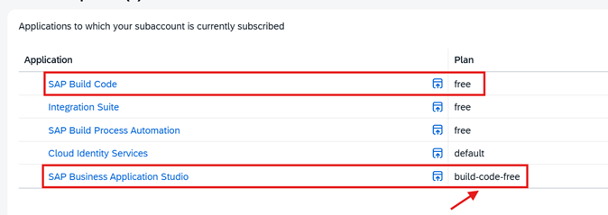
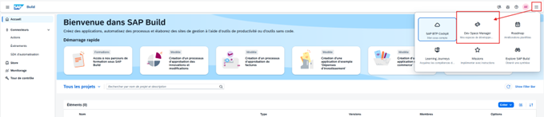
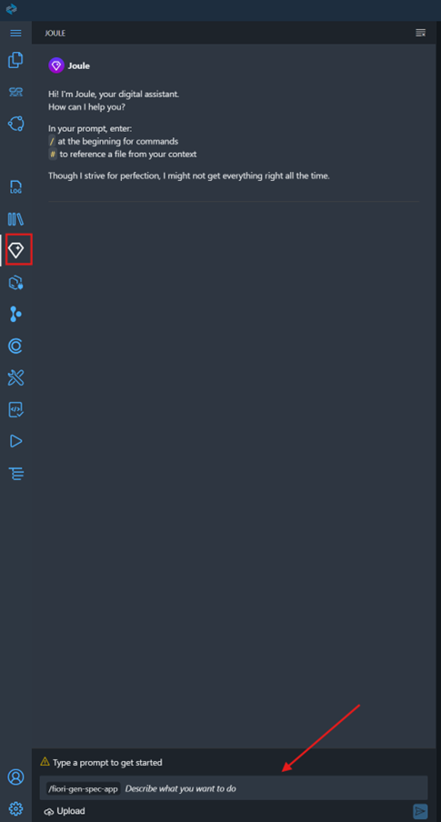
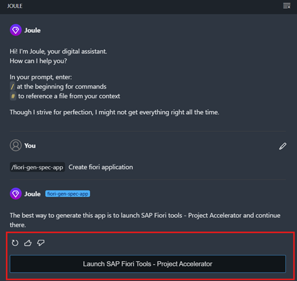
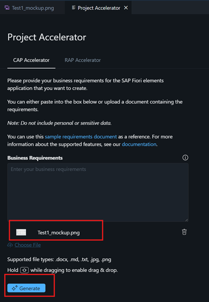
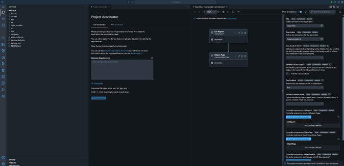
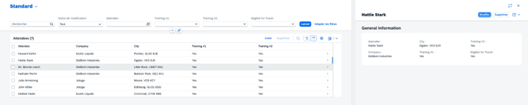
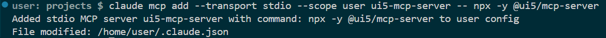

# Hands-on Tutorial : 
TODO: faire comme le hands-on tuto de SAP avec des étapes et des fichiers différents pour chaque étape

-> Description courte
-> le fil rouge qui présente toutes les autres documentations aussi (exemple : prompt guide)

Table de matière

Vous pouvez suivre ce hands-on pas à pas pour réaliser entièrement le cas d'usage guidé. 

Nous vous recommandons de suivre les premières étapes, si nécessaires, pour mettre en place Claude Code, l'otpimiser et avec des tips sur son utilisation. Puis, de rédiger les spécifications, utiliser le project Accelerator et de réaliser les itérations par vous même pour prendre en main les outils et comprendre au mieux le use case.

## Take charge of the use case and draft the functional specifications

First, take the time to thoroughly familiarize yourself with the use case, the stated business requirements, and the various proposed sprints. To do so, feel free to refer to the context of the Serious Game and all related documents.

The goal of this phase is to draft detailed functional specifications. Why is this crucial? Because these specifications will serve as a true “compass” for your AI Agents. By providing them with this reference document as input (in their context or “pipeline”), you ensure that you guide them precisely throughout the development sprints.

To help you get started, we’ve provided specification templates. These will guide you on the best format to use when organizing your ideas. You’ll also find concrete examples of specifications already written specifically for this use case. Feel free to use them as a reference to understand the level of detail expected before the coding phase.

To make this process easier, we strongly encourage you to use generative AI tools such as Claude, Gemini, or Joule. These assistants are highly effective at generating or structuring documents and have excellent technical expertise in SAP CAP and Fiori UI5 environments.

Our tips for effectively guiding the AI during the writing process:
* Be thorough: Write prompts that describe your requirements in as much detail as possible and clearly define the exact scope of the application.
* Provide context: Directly provide the AI with the source documents (the requirements document, the sprint breakdown chart, as well as the templates and examples provided).
* Iterate: Don’t hesitate to interact with the tool to refine the document until you have complete specifications ready to be converted into code.

## Sprint 1 - Project Initialization

Once you have created and drafted your functional specifications, we can begin developing the application. To do this, we will use and explore the Project Accelerator tool available in SAP Business Application Studio.

### Principles of the Accelerator Project
The Accelerator project is a tool integrated into BAS that allows you to generate a CAP or RAP application framework from a paper or Figma mockup, a description, or a business document in DOCX or MD format. This tool accelerates the creation and development of an application, but its sole purpose is to initiate the project. It cannot be used iteratively to generate code for adding features or fixing bugs. For that, we are exploring AI agents for “coding”.

### Steps for using the Project Accelerator 
| #    | Steps    | Captures |
| :--: | :--- |  :-----   |
| 0 | Open SAP Business Application Studio and create a devspace named “Full-Stack Application Using Productivity Tools,” which is a prerequisite for creating the CAP/ Fiori application. |  |
| 1 | In the cockpit BTP, let's access to instance and click on SAP Business Application Studio. <br> Then, let click in the button in the right area of the window and select Buisness Application Studio. |  <br>  |
| 2 | After that, select the Joule buton in the left sidebar. <br> trhen, choice the command /fiori-gen-spec-app and enter a short description of the application that you want to create. |  |
| 3 | Click on the button "Launch SAP Fiori Tools - Project Accelerator". If everything works, you should see the new Project Accelerator window. |   |
| 4 | After that, give your Business requirements in the text area, or select a file such as your figma / paper mockup or your business requirement in .docx or .md format. <br> Click on "Generate" to start the initialization of the application. |   |
| 5 | After the process, you can see the generated project (here a CAP project). You can modify some rules and options with the no-code approach (like switch to the flexible display format), and you can preview the application. |   |
| 6 | If everything went well, you should see the app! |  |


## Set up Claude code

We now have an initialized, functional app that can be previewed. We will now use Claude Code to iterate on the project and code by adding, modifying, and reviewing it.

### Claude Code Installation

First, we’ll install Claude Code in our DevSpace. For instructions, please refer to the following document [Claude Code Setup Guide](exercises/..) or the official Anthropic documentation.

**Note :** You can also use Cline as an AI agent for development, but this tool is not covered or used in this hands-on.

### Add MCP server
To optimized Claude Code and give it more specific knowledge, tools, etc. So we are going to add the UI5, Fiori and CAP MCP Server to Claude Code.

*UI5 MCP server:*
https://www.npmjs.com/package/@ui5/mcp-server

```bash
# Setup
$ claude mcp add ui5-server -- npx -y @ui5/mcp-server
```


Or you can modify the general configuration of Claude Code (File : ~/.claude.json) with :
```json
{
  "mcpServers": {
    "ui5-server": {
      "type": "stdio",
      "command": "npx",
      "args": [
        "-y",
        "@ui5/mcp-server"
      ]
    }
  }
}
```

*Fiori MCP server:*
https://www.npmjs.com/package/@sap-ux/fiori-mcp-server
```bash
# Setup
$ claude mcp add fiori-server -- npx -y @sap-ux/fiori-mcp-server
```

*CAP (NodeJs) MCP server:*
https://www.npmjs.com/package/@cap-js/mcp-server
```bash
# Setup
$ claude mcp add cap-server -- npx -y @cap-js/mcp-server
```

### Set up and customize Claude Code

After installing Claude Code and adding MCP servers to it to expand its knowledge of CAP, Fiori, and UI5, we will finalize its configuration before starting our code iterations.

To get started, launch Claude Code via the extension or in your terminal and type the command /init. This command instructs Claude to analyze your project's current structure and generate a seed file.

Once the process is complete, a `CLAUDE.md` file will appear in the root directory of your project. This file acts as the “memory” and “brain” of your AI agent. It is read at the start of each new session to immediately give the agent a comprehensive overview of the application and its rules.

The goal now is to customize this file so that it matches our specifications and development guidelines exactly, and to provide Claude with the most detailed guidance possible.

Here are the key sections we recommend adding or modifying in your CLAUDE.md file:

**1. Project Overview:** <br>
Improve the default description. Briefly detail the “What” (a Vendor Management application) and the “Why” (cleaning up the vendor database). The clearer the business context is for the AI, the more relevant its technical choices will be.

**2. Reference Documents & Specifications:** <br>
It is crucial to add a section telling Claude Code where to find your functional specification documents (which you drafted in the previous step). For example, tell it: “To learn about the features of each sprint, always refer to the specifications.md file.” This way, the agent will know exactly what to base its decisions on without you having to repeat it at every prompt.

**3. Development Guidelines (Coding Guidelines):** <br>
Add a section listing your company’s technical constraints. For example: the requirement to use a specific version of Node.js, the prohibition on modifying certain SAP system files, or your naming conventions for CAP (CDS) entities.

**4. Rules for using MCP servers:** <br>
We previously connected MCP servers to Claude Code. For it to use them correctly, we need to provide it with instructions. The official AI ecosystem documentation often explains how to add these rules to an AGENTS.md file (used by other tools like Cline). In our case with Claude Code, the CLAUDE.md file serves as the central hub for everything.

Here are the rules to add to CLAUDE.md, as specified in the MCP server documentation : 
```markdown
## Development Guidelines for Claude (SAP CAP / Fiori / UI5 Project)

You are an expert developer in SAP technologies (CAP Node.js, Fiori Elements, UI5). You have access to MCP servers to consult SAP documentation and tools. You must Stricly adhere to the following rules.

### Guidelines for UI5

Use the `get_guidelines` tool of the UI5 MCP server to retrieve the latest coding standards and best practices for UI5 development.

### Rules for creation or modification of SAP Fiori elements apps

- When asked to create an SAP Fiori elements app check whether the user input can be interpreted as an application organized into one or more pages containing table data or forms, these can be translated into a SAP Fiori elements application, else ask the user for suitable input.
- The application typically starts with a List Report page showing the data of the base entity of the application in a table. Details of a specific table row are shown in the ObjectPage. This first Object Page is therefore based on the base entity of the application.
- An Object Page can contain one or more table sections based on to-many associations of its entity type. The details of a table section row can be shown in an another Object Page based on the associations target entity.
- The data model must be suitable for usage in a SAP Fiori elements frontend application. So there must be one main entity and one or more navigation properties to related entities.
- Each property of an entity must have a proper datatype.
- For all entities in the data model provide primary keys of type UUID.
- When creating sample data in CSV files, all primary keys and foreign keys MUST be in UUID format (e.g., `550e8400-e29b-41d4-a716-446655440001`).
- When generating or modifying the SAP Fiori elements application on top of the CAP service use the Fiori MCP server if available.
- When attempting to modify the SAP Fiori elements application like adding columns you must not use the screen personalization but instead modify the code of the project, before this first check whether an MCP server provides a suitable function.

### Rules and Guidelines for CAP

- You MUST search for CDS definitions, like entities, fields and services (which include HTTP endpoints) with cds-mcp, only if it fails you MAY read \*.cds files in the project.
- You MUST search for CAP docs with cds-mcp EVERY TIME you create, modify CDS models or when using APIs or the `cds` CLI from CAP. Do NOT propose, suggest or make any changes without first checking it.
```

**Tip: Keep the file concise!** <br>
Don’t copy all your specifications directly into CLAUDE.md, as this file is constantly reloaded and could overload the agent’s memory (and consume too many tokens). Instead, use short instructions that link to other reference files.

To save you time and give you a concrete starting point, feel free to refer to this document [...]. It is a pre-filled CLAUDE.md file template that has been specially adapted for our use case!

Your AI agent is now fully configured and ready to use. You’ve just given it everything it needs to understand your project. We can now move on to code iteration.

Further Reading (Optional):
If you're curious and want to deepen your understanding of Claude Code and its advanced customization capabilities, you can check out this supplementary document [...]. It includes additional tips as well as direct links to Anthropic's official documentation.

## Premier Prompt Claude Code

To get started, we recommend that you review the current codebase of your project generated by the Project Accelerator. It is crucial to ensure that the foundation is solid and that the initial requirements for our Sprint 1 are in place.

**1. Project Audit** <br>
Ask Claude Code to audit your current project, specifying that he should verify whether all the features expected for Sprint 1 have been implemented.

Example prompt:
```txt
I generated the application using the Project Accelerator and want to make sure that all the features for the first sprint are in place.
Expected features: 
- ...
- ...
To do this, can you perform a complete audit of my current SAP CAP/Fiori project? You can also refer to the specifications file and let me know if all Sprint 1 requirements have been correctly implemented.
```

**2. Analysis of the generated report**
Following this request, Claude Code will review your files and prepare a detailed report for you. It will clearly outline what has been successfully implemented, what is missing, and what could be improved or modified to comply with SAP development best practices.

**3. Planning and Implementing Corrections**
If the report reveals that elements are missing (for example, a field in schema.cds or an interface annotation), you can ask it to plan and implement the necessary changes directly.

Exemple de prompt :
```txt
Thank you for the audit. Can you plan and implement the changes to add the missing elements from Sprint 1?
```

## Sprints & Iterations: Adding Features


// Mentionner les autres documents à utiliser ou ultra important pour les itérations Claude Code

// Guide & tuto étape par étape en lien avec la réalisation de l'application

