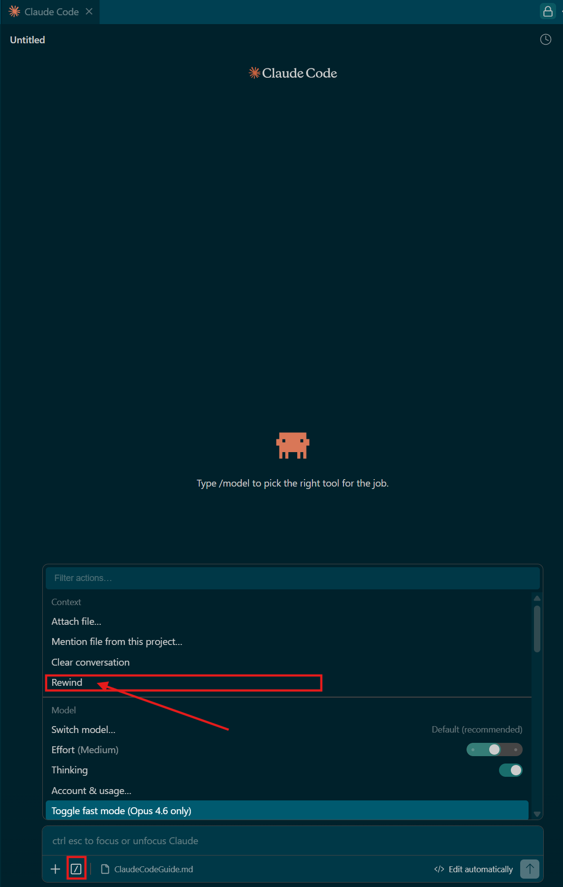

# Claude Code Guide

Welcome to the Claude Code Reference Guide. This document is designed to guide you step by step, from basic installation to advanced configurations (MCP servers, context management), so that this AI can become your best partner for SAP CAP and Fiori development.

You can also refer to Anthropic's official documentation on Claude Code: : [Claude Code official documentation](https://code.claude.com/docs/en/quickstart)

## During the workshop - Hackathon

For the hackathon workshop, we have already set up the development environments. So you don’t have to:
- Create a DevSpace Full-Stack Application in SAP BAS
- Install Claude Code & the associated extension
- Set up the MCP servers

> [!IMPORTANT]
> This guide will be useful for you to know how to initiate the CLAUDE.md file via the /init command and how to modify this same file by adding the rules associated with the MCP servers.

> [!NOTE]
> There is also some interesting information on the functioning of Claude Code, tips and usage advice (eg plan mode).

## Outside of a Hackathon

> [!IMPORTANT]
> If you redo the scenario or if you discover this use case and you are looking to learn the AI Agent for coding approach and use these tools. You can follow the entirety of this guide.

## 1. Installation & Authentication (Setup)

Before we can generate code, we need to install the tool and link it to an authorized account.

### 1.1 Install Claude Code via the Terminal
In your SAP Business Application Studio (BAS) or Visual Studio Code environment (on your local machine), open a new terminal. Run the following command to install the Claude Code command-line interface (CLI):

```bash
# Install claude code
$ curl -fsSL https://claude.ai/install.sh | bash
# Start claude code
$ claude

# After a project accelerator, use this command to allow claude code to "understand" your project
> /init
# After the command, CLAUDE.md file is created
```

### 1.2 Install the Claude Code Extension
To avoid using Claude Code in the terminal, you can add an extension in SAP BAS to get a more user-friendly and easier-to-use interface.

To do that : 
1. Find the extension bouton in the left sidebar
2. Click on extension
3. Reseach "Claude code"
4. Install "Claude Code for VS Code"

### 1.3 Authentication
TODO : mettre images

For Claude Code to work, it must be connected to an account with the necessary permissions (a Claude Pro account or an API key).

If you have a Claude account with the Pro or Max plan, you can use the terminal to log in 
```bash
$ claude login
```

> [!NOTE]
> This command will generate a link. Click on it to open a web page in your browser, log in to your Anthropic account, and then authorize the app.

If you have an API key on hand, you can use it to make a request to Claude.
...

### 1.4 Change your account or API key

### 1.5 Initial Project Setup
Once the tool is installed and connected, you need to help it understand the structure of your current project (especially if you have just generated a code base using a Project Accelerator or Fiori Generator).

In the Terminal or in the extension, type the following command:
```bash
> /init
```

> [!NOTE]
> This command scans your folder structure and creates a CLAUDE.md file in the root directory. This file will serve as the AI's local “memory” for this specific project. You can customize it later to define your development rules (see Section 3).

## 2. Basic Concepts and Usage
Once Claude Code is installed, it’s important to understand how to use it. The tool does more than just generate text: it reads your files, suggests solutions, and can even run commands in your terminal. Here’s how to master it.

### 2.1 Interaction Modes
Claude Code offers different levels of autonomy. You can switch modes depending on how much control you want over the project:

* “Ask before” mode (Default): This is the safest mode. Claude will analyze your request, suggest code or terminal commands (such as installing an npm package or creating a .cds file), but will always ask for your confirmation (Y/n) before executing anything.

* “Plan” Mode: Ideal for the design phase (for example, before starting a new Sprint). In this mode, Claude will focus solely on the architecture, list the files to be created or modified, and explain his reasoning without writing a single line of code or modifying your files.

* “Auto-accept” mode (Warning): Claude executes its scripts, modifies files, and runs commands completely on its own. Use with extreme caution, and only after you've made a git commit right before.

### 2.2 Essential Commands (Slash Commands)
In the Claude Code interface, you can use commands that start with a slash (/) to quickly control the tool:
* `/help`: Displays a list of all available commands. Perfect for when you can't remember a command!

* `/compact`: This is the most important command for a long project. It allows Claude to “compress” the current conversation to free up memory (tokens). Use it as soon as the conversation gets too long to keep the agent fast and relevant.

* `/clear`: Completely clears the history of the current conversation and starts over from scratch. Handy when switching from a Fiori feature to a CAP backend feature, so as not to mix contexts.

* `/init`: (Seen in Section 1) Initializes the project context and creates the CLAUDE.md file.

### 2.3 Choosing the Model: “Effort” and “Extended Thinking”
Claude Code's capabilities depend on the AI model it uses. By default, it uses Claude 3.7 Sonnet (as of the time this guide was written), which is the most advanced model for code development.

* **Switch Model:** You can sometimes switch to faster models (such as Haiku) for very simple tasks, but for SAP CAP/ Fiori development, stick with Sonnet.

* **Extended Thinking:** This is a major feature. For complex bugs or difficult architectures (such as calculating your risk score), you can enable “Thinking.” Claude will then “think” for several seconds (or even minutes) before responding, which drastically improves the quality of its code.

* **Effort:** This setting determines how far Claude can go in its search and error-correction loops before stopping and handing control back to you.

### 2.4 General Settings
To customize your experience, you can use the following command:
```bash
> /settings
```
This will open an interactive menu where you can:
* Enable or disable the modes described above.
* Manage the display theme.
* Configure cost limits or token usage.
* Enable global MCP servers.

## 3. Advanced Setup and Optimization
To get the most out of Claude Code, it’s not enough to just ask it questions. You need to provide it with the right business context and the right tools (MCP), and create shortcuts (Skills) to speed up your development.

### 3.1 The Local Brain: The `CLAUDE.md` file
As seen during initialization (`/init`), Claude Code generates a CLAUDE.md file in the root directory of your project. This file is essential. It is automatically read by the AI at the start of each new session and acts as a permanent "System Prompt".

What to include: 
* A clear summary of your project (e.g., Application for managing inactive suppliers).

* Links to your functional specification documents (e.g., “Always refer to the /docs/specifications folder for business rules”).

* Your coding conventions (e.g., “Always use Node.js for CAP handlers; never modify automatically generated files”).

>[!TIP]
> Keep this file concise. If it’s too long, it will unnecessarily consume tokens with every request.

### 3.2 Add MCP (Model Context Protocol) Servers
SAP has officially released its own MCP servers. The Model Context Protocol is a standard that enables Claude Code to securely connect to external tools or access highly specific knowledge in real time. This is essential for it to fully understand the SAP ecosystem.

#### Add the MCP server for SAP CAP:
Open your terminal and type:
```bash
# Global installation of the npm package
$ npm i -g @cap-js/mcp-server
# Add to claude
$ claude mcp add cds-mcp -- npx -y @cap-js/mcp-server
```
https://www.npmjs.com/package/@cap-js/mcp-server

#### Add the MCP server for SAP Fiori:
https://www.npmjs.com/package/@sap-ux/fiori-mcp-server
```bash
# Global installation of the npm package
$ npm i -g @sap-ux/fiori-mcp-server
# Add to Claude Code 
$ claude mcp add fiori-server -- npx -y @sap-ux/fiori-mcp-server
```

#### Add the MCP server for SAP UI5:
https://www.npmjs.com/package/@ui5/mcp-server

```bash
# Setup
$ claude mcp add ui5-server -- npx -y @ui5/mcp-server
```

You can now test whether Claude Code has access to the CAP, Fiori, UI5 and others MCP server by using the following command:
```bash
$ claude mcp list
# Result : 
Checking MCP server health...

claude.ai Gmail: https://gmail.mcp.claude.com/mcp - ! Needs authentication
claude.ai Google Calendar: https://gcal.mcp.claude.com/mcp - ! Needs authentication
cds-mcp: npx -y @cap-js/mcp-server - ✓ Connected
fiori-server: npx -y @sap-ux/fiori-mcp-server - ✓ Connected
...
```

#### Add Rules
After installing the MCP servers, you must add these rules (provided in their documentation) to your `CLAUDE.md` file.

```markdown
## Development Guidelines for Claude (SAP CAP / Fiori / UI5 Project)

You are an expert developer in SAP technologies (CAP Node.js, Fiori Elements, UI5). You have access to MCP servers to consult SAP documentation and tools. You must Stricly adhere to the following rules.

### Guidelines for UI5

Use the `get_guidelines` tool of the UI5 MCP server to retrieve the latest coding standards and best practices for UI5 development.

### Rules for creation or modification of SAP Fiori elements apps

- When asked to create an SAP Fiori elements app check whether the user input can be interpreted as an application organized into one or more pages containing table data or forms, these can be translated into a SAP Fiori elements application, else ask the user for suitable input.
- The application typically starts with a List Report page showing the data of the base entity of the application in a table. Details of a specific table row are shown in the ObjectPage. This first Object Page is therefore based on the base entity of the application.
- An Object Page can contain one or more table sections based on to-many associations of its entity type. The details of a table section row can be shown in an another Object Page based on the associations target entity.
- The data model must be suitable for usage in a SAP Fiori elements frontend application. So there must be one main entity and one or more navigation properties to related entities.
- Each property of an entity must have a proper datatype.
- For all entities in the data model provide primary keys of type UUID.
- When creating sample data in CSV files, all primary keys and foreign keys MUST be in UUID format (e.g., `550e8400-e29b-41d4-a716-446655440001`).
- When generating or modifying the SAP Fiori elements application on top of the CAP service use the Fiori MCP server if available.
- When attempting to modify the SAP Fiori elements application like adding columns you must not use the screen personalization but instead modify the code of the project, before this first check whether an MCP server provides a suitable function.

### 3.4 Rules and Guidelines for CAP

- You MUST search for CDS definitions, like entities, fields and services (which include HTTP endpoints) with cds-mcp, only if it fails you MAY read \*.cds files in the project.
- You MUST search for CAP docs with cds-mcp EVERY TIME you create, modify CDS models or when using APIs or the `cds` CLI from CAP. Do NOT propose, suggest or make any changes without first checking it.
```

### 3.3 Automation: Skills, Agents, and Plugins
To work even faster, Claude Code lets you create your own tools and workflows.
In Claude Code, Skills are Markdown files (typically located in a .claude/skills/ folder) that act as smart macros that can be invoked using “slash commands” (e.g., /create-fiori-app).

* **Skills:** In Claude Code, Skills are Markdown files (typically located in the .claude/skills/ folder) that act as smart macros. You can invoke them using custom “slash commands.”

    * *Example:* You could create a file defining how to generate a standard Fiori application and call it using the /create-fiori-app command. The AI will know exactly which files to create and which commands to run.

* **Agents and Plugins:** You can extend Claude Code by connecting it to agent orchestrators or community plugins. These tools allow the AI to interact with other APIs (such as Jira to read your Sprint tickets, or GitHub to analyze Pull Requests).

## 3. Best practices & documentations

* [Anthropic - Best practices](https://code.claude.com/docs/en/best-practices)
* [Anthropic - How extend Claude Code](https://code.claude.com/docs/en/features-overview#match-features-to-your-goal)
* [Anthropic - Documentation for Claude Code in Visual Studio Code](https://code.claude.com/docs/en/vs-code)
* [Anthropic - For more details . How Works Claude Code](https://code.claude.com/docs/en/how-claude-code-works)

## 4. Survival Guide & Best Practices

> [!Warning]
> Claude Code is not infallible. It can make mistakes that compromise the stability of your project. Keep in mind that it may modify or delete code on its own, or take an inappropriate technical approach. Here are the golden rules for coding with peace of mind.

### 4.1 Git is your safety net

Commit your functional code very frequently! Save your progress in Git every time you reach a stable state (at the end of a sprint, after adding a new CDS entity, a new Fiori chart, etc.).

If Claude Code breaks your application and gets things mixed up, use these commands to roll back:
```bash
$ git status
$ git restore .
$ git clean -fd
```

*using the Claude Code Extension:*


### 4.2 Time-box your debugging
Don’t get stuck in an endless loop with the AI. Limit yourself to a maximum of 3 or 4 prompts to fix a specific bug. If the problem persists or if Claude Code starts going in circles, that’s a sign to stop: revert the changes with Git, completely rephrase your initial prompt, or ask an instructor for help.

### 4.3 Manage the Context (Watch Out for Tokens!)
Claude Code reads your project files to understand the context. If it reads too much unnecessary data, it gets confused and uses up your quota very quickly.

* **Close unnecessary files:** Don’t leave dozens of tabs open if you’re not working on them.

* **Clear the memory:** Regularly use the command > /compact in the Claude Code chat to compress the conversation history.

### 4.4 The Art of the Prompt (Clarity and Review)
* **Provide specific context:** Be as detailed as possible. Clear instructions (using your specification file) allow Claude Code to plan its actions correctly.

* **Review before accepting:** In “Ask before” mode, always inspect the proposed changes (the diff) before saying “Yes.” If something seems illogical, reject the change and adjust your prompt.

> [!TIP]
> Final Tip
> There are numerous ways to prompt, iterate, formulate our requests, etc. Many parameters vary and GenAI models are stochastic. It is therefore normal not to have exactly what one wants on the first try.
> The idea is to know how to adapt: 
>   - Sprint with completely new features > request to plan and add the features.
>   - Functionality or very complex element > on the gap of the sprint and iterate independently
>   - Sprint with improvements of an Object Page, a List Report, or other elements already existing in the application as-is > Test a schedule or ask to do a detailed step-by-step (gap), then iterate >on each substep.
>
> There are many different scenarios and cases. And, there is never a single way to add the features. Trying and practicing is the best way to learn. 

## 5. Resource Directory
This section brings together all the documentation to help you expand Claude Code's capabilities and master the art of prompt engineering.

**1. Official Resources:**
* [Claude Code Documentation (Quickstart, Best Practices, Workflows).](https://code.claude.com/docs/en/quickstart)

**2. How Claude Code Works?**
These resources explain the "under the hood" mechanics of how the AI interacts with a local codebase.

* [Claude Code Overview](https://code.claude.com/docs/en/overview): This is the fundamental guide. It explains Claude's "agentic loop"—how it reads the codebase, plans an approach, edits multiple files, and runs commands to verify its work.

* [Security & Sandboxing](https://www.anthropic.com/engineering/claude-code-sandboxing): An excellent engineering blog post explaining how Claude Code isolates file systems and network access to safely execute code and terminal commands without breaking the user's machine.

**3. How to Prompt Claude Code?**
These guides focus on the syntax and methodology of writing highly effective instructions for the AI.

* [Prompting Best Practices](https://platform.claude.com/docs/en/build-with-claude/prompt-engineering/claude-prompting-best-practices): The definitive guide from Anthropic. It teaches crucial techniques like using XML tags (e.g., <context>, <instructions>) to structure complex prompts, giving clear success criteria, and telling Claude what to do instead of what not to do.

* [Common Code Workflows](https://code.claude.com/docs/en/common-workflows): This page is a goldmine for your workshop. It gives exact prompt examples for tasks like: "find functions in [file] that are not covered by tests" or "trace the login process from front-end to database."

**4. Community & Advanced Resources:**
* [GitHub Public Repository - The performance optimization system for AI agent harnesses](https://github.com/affaan-m/everything-claude-code)

* [GitHub Public Repository - A curated list of awesome skills, hooks, slash-commands, agent orchestrators, applications, and plugins for Claude Code](https://github.com/hesreallyhim/awesome-claude-code)

**5. Best Practices for Developers & Dev Teams**
* [Using the CLAUDE.md File](https://code.claude.com/docs/en/overview): (Found in the customization section). This explains how a team can drop a CLAUDE.md file in the root of their project to force the AI to follow specific coding standards, architectural rules, and preferred libraries across all team members.

* [Model Context Protocol (MCP)](https://code.claude.com/docs/en/mcp): Essential for enterprise teams. It explains how to securely connect Claude Code to external dev tools (like Jira for tickets, Sentry for logs, or internal PostgreSQL databases) so the AI has full context of the team's environment.

**6. Use Cases with Claude Code for "Coding"**

* [How Anthropic Teams Use Claude Code (Whitepaper PDF)](https://www-cdn.anthropic.com/58284b19e702b49db9302d5b6f135ad8871e7658.pdf): A highly relevant case study detailing real-world coding scenarios: fast prototyping with "auto-accept" mode, complex infrastructure debugging, test-driven development workflows, and helping newcomers explore massive legacy codebases.

* [Building a C Compiler with Parallel Claudes](https://www.anthropic.com/engineering/building-c-compiler): A fascinating use case showing how developers can spawn multiple autonomous Claude Code agents (subagents) to work on different bugs in parallel.