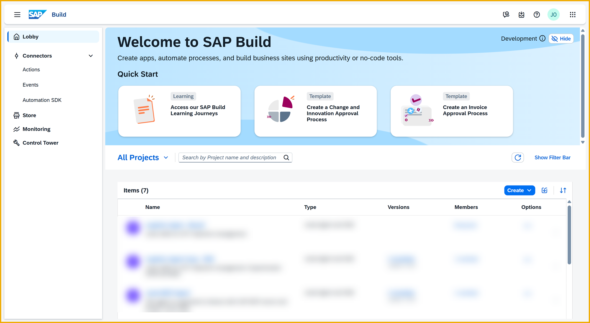
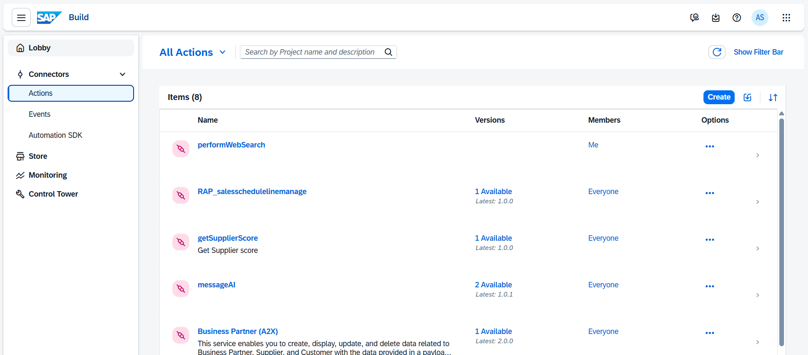
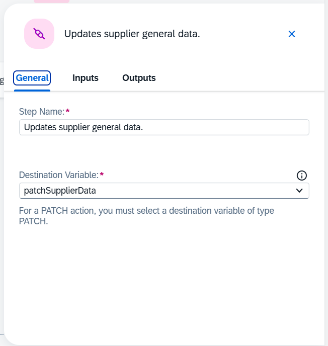
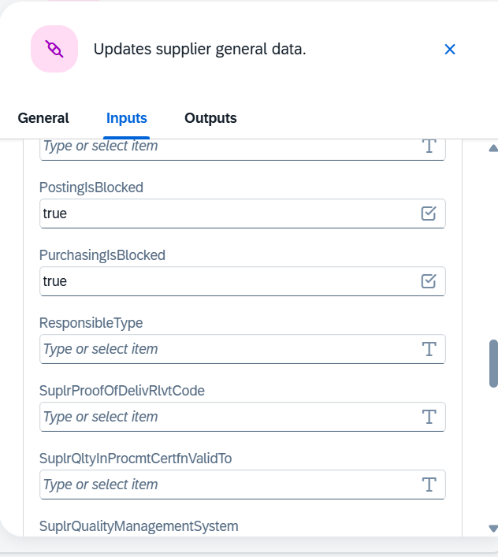
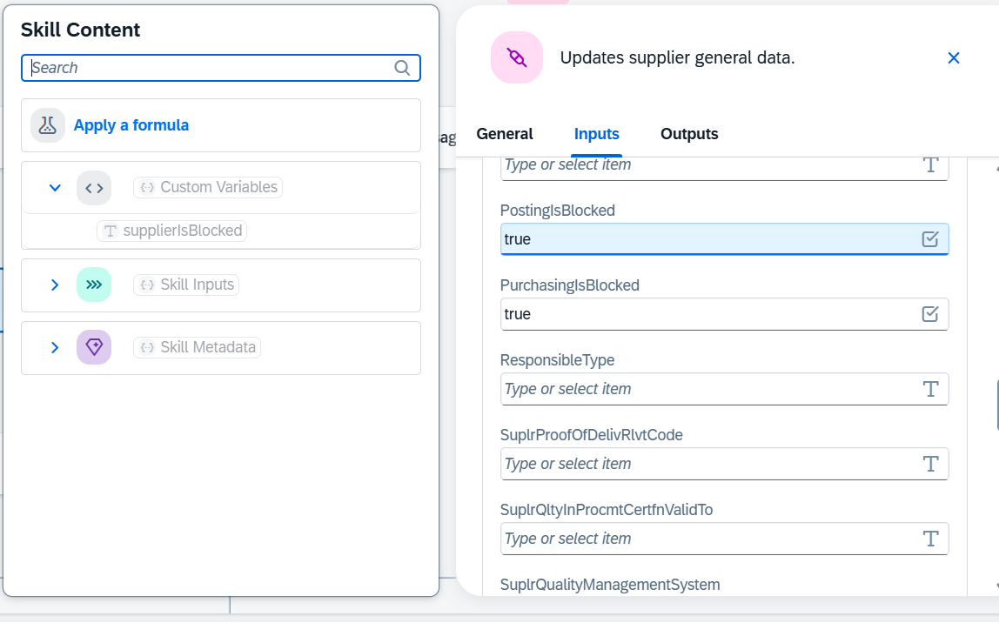
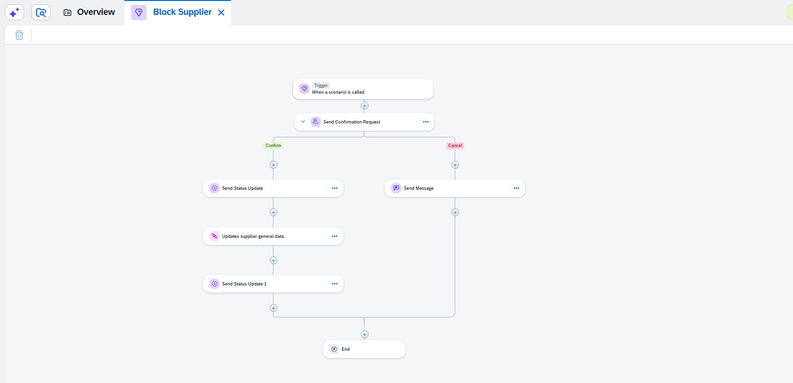
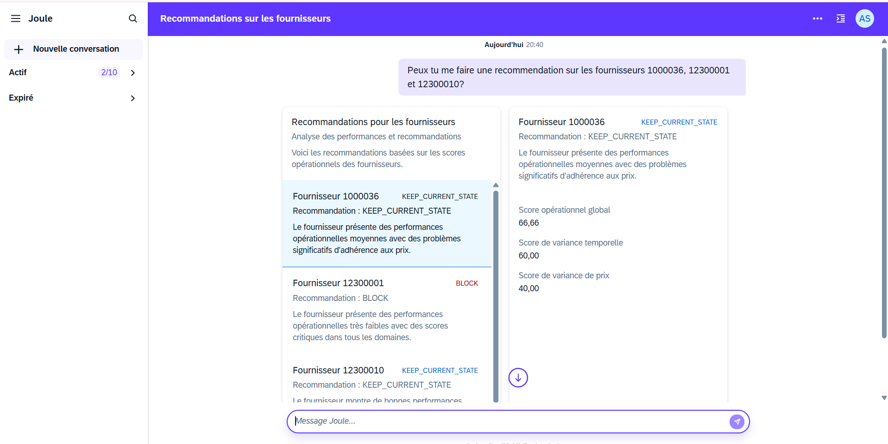
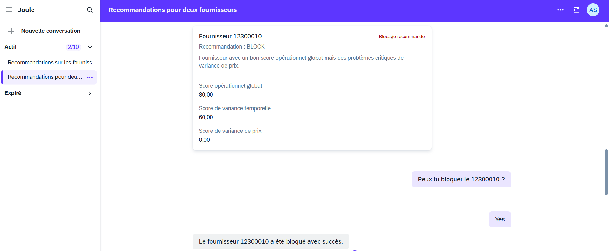

# Hands-on Joule Studio – Supplier management with Skills and Agent

Welcome to this Joule Studio hackathon!

In this workshop, you will step-by-step create **Joule Skills** and a **Joule Agent** to help business users manage their suppliers directly in natural language, without having to navigate through multiple SAP applications.

The goal is to have, at the end of the workshop, a complete demo in which a user can:
- request the **blocking** or **unblocking** of a supplier;
- retrieve an **evaluation** of this supplier from S/4HANA;
- get a **reasoned recommendation** before making their decision.

The **SAP Build Process Automation** actions required to interact with S/4HANA are already available, but not all of them will be useful: it is up to you to identify the right actions and expose them to Joule via the Skills.

---

## General context

We want to equip the purchasing / risk function with a Joule copilot capable of answering questions such as:

> “Can you check this supplier and tell me if we should block them?”  
> “Unblock supplier 12345 if the risk is low.”

To achieve this, we will:
- use **SAP Build actions** to perform the technical operations (blocking, unblocking, reading data in S/4HANA);
- encapsulate these actions in **Joule Skills**;
- orchestrate everything in a **Joule Agent** that reasons, investigates, and proposes a recommendation.

Retrieving external information (web, third-party databases, press, etc.) is **optional**: focus first on internal S/4HANA data, then add external sources only if time allows.

---

## Prerequisites

Before starting, make sure you have:

- **access to Joule Studio** in your BTP subaccount / SAP Build environment;
- a SAP Build Process Automation space with **pre-created actions** to:
  - block a supplier,
  - unblock a supplier,
  - retrieve supplier evaluation information from S/4HANA;
- the links / screenshots provided by the organizers to guide you through the Joule Studio interface.

No prior Joule Studio experience is required, but familiarity with SAP Build or S/4HANA is a plus.

---

## Overview of the sprints

The workshop is structured into **3 progressive sprints**:

1. **Sprint 1: Blocking / unblocking Skill**  
   Get a first concrete result: a skill that allows the agent to request supplier blocking or unblocking, with summary and confirmation.
2. **Sprint 2: Supplier evaluation Skill**  
   Retrieve a supplier’s evaluation and produce a score based on the defined criteria.
3. **Sprint 3: Decision-making Joule Agent**  
   Build an agent that investigates, consolidates information (internal and possibly external), and provides a reasoned recommendation before calling the skills.

You can progress at your own pace, but we recommend **validating each sprint** before moving on to the next.

---

## Sprint 1 – Supplier blocking / unblocking Skill

> “I want a first concrete and demonstrable result: a Joule Skill that allows the agent to request the blocking or unblocking of a supplier in natural language.  
> The user should only provide the supplier number.  
> Then, Joule must display a summary and ask for validation before executing the action.”

### Objective

Create a **Joule Skill** that encapsulates the SAP Build actions to block / unblock a supplier.  
The user should simply provide the **supplier / BP number**, and Joule must:

1. retrieve the necessary information to present a **summary** (e.g. supplier name, current status);
2. explicitly ask the user to **confirm** the action;
3. only after confirmation, call the corresponding SAP Build action.

### Proposed steps

1. **Explore the available actions**  
   - Open the list of SAP Build actions provided.  
   - Identify those related to supplier blocking / unblocking and those that are “traps” (not needed for this use case).

2. **Create the Joule Skill**  
   - In Joule Studio, create a new **Skill** dedicated to blocking / unblocking.  
   - Clearly define:  
     - the intention: “manage the blocking status of a supplier”;  
     - the inputs: supplier / BP number (simple, mandatory type);  
     - the outputs: final status, confirmation message.

3. **Wire the SAP Build action**  
   - Link the Skill to the correct SAP Build action (blocking or unblocking).  
   - Check parameter mapping (name, type, format).

4. **Handle confirmation**  
   - Add a step in your Skill / Agent logic (depending on configuration) to:  
     - present a readable summary;  
     - ask the user to confirm (“Yes, block” / “No, cancel”).  
   - Ensure that **without explicit confirmation**, no blocking action is executed.

5. **Test in conversation**  
   - From Joule, test sentences such as:  
     - “Block supplier 12300010”  
     - “Unblock supplier 12300010”  
   - Validate that:  
     - a summary is displayed,  
     - confirmation is requested,  
     - the action is only triggered after validation.

## Expected deliverables

- **Configured Joule Skills**:  
  - 1 supplier blocking / unblocking Skill (Sprint 1),

## Creation steps

| # | Steps | Captures |
| :--: | :--- | :----- |
| 0 | Open SAP Build and navigate to the actions. Actions are API calls that can be configured to be used as a Skill. You can import a Swagger file or directly use the APIs published by SAP on the Business Accelerator Hub. | |
| 1 | Not all actions you find here will necessarily be useful to meet the requirement, you can analyze them to see which best addresses the need. | |
| 2 | Go back to the lobby, then open the project Joule Studio - Hackathon 2026, and start creating the skill. | |
| 3 | The determining element of the Skill will be the configuration of the action. Once chosen, you must first specify a destination variable. Destinations are the elements that allow the agent to authenticate when making an API call; they contain the credentials and the endpoint to call. | |
| 4 | Then, as for a standard API call, specify the call parameters that Joule must send. | |
| 4bis | Be careful: to ensure parameters are sent correctly, it is recommended to specify them using the formula editor. | |
| 5 | Here is an example of a complete skill; note however that there is not only one possible solution to the requirement, feel free to propose your own approach. | |

---

## Sprint 2 – Supplier evaluation Skill

> “Now, we need to evaluate our suppliers.  
> I want a Joule Skill that allows the agent to retrieve a supplier’s evaluation.  
> The user should only provide the supplier number.  
> Then, Joule will define the score according to the defined criteria.”

### Objective

Create a **Joule evaluation Skill** that uses a SAP Build action to retrieve supplier scoring or evaluation data from S/4HANA, and that calculates or exposes a **score** according to the criteria defined in the system (or in your own logic).

### Proposed steps

1. **Analyze the evaluation action**  
   - Go through the available SAP Build actions to find the one that returns:  
     - scores,  
     - indicators such as reliability, compliance, performance, etc.

2. **Create the evaluation Skill**  
   - Create a dedicated Skill: “Evaluate a supplier”.  
   - Expected input: supplier / BP number.  
   - Expected outputs:  
     - score value(s),  
     - possible details by criterion,  
     - simple interpretation (e.g. “low”, “medium”, “high”).

3. **Define the scoring logic**  
   - Depending on the returned data:  
     - either use a score already calculated by S/4HANA,  
     - or apply a simple logic (for example the average of several criteria).

4. **Test the Skill**  
   - Ask Joule:  
     - “Give me the evaluation of supplier 1000001”  
   - Check that:  
     - the Skill is called,  
     - the data is retrieved,  
     - the score or conclusion is understandable for a business user.

For this Skill, the key point is that the agent must be able to retrieve the rating elements.  
It is not mandatory to include decision logic based on the score; that can be defined in Sprint 3.

---

## Sprint 3 – Decision-making Joule Agent

> “The Skills execute, great. Now I want a Joule Agent that helps decide.  
> Before blocking/unblocking, the agent must investigate: retrieve internal and external* information (web, third-party databases, press, etc.) and produce a reasoned recommendation.  
> Only then does the user choose, and the agent triggers the action via the Skill.”

\* Retrieving **external** information is optional for the hackathon.

### Objective

Build a **Joule Agent** which, from a simple user question, will:

1. use the **evaluation Skill** (Sprint 2) to retrieve internal S/4HANA data;
2. optionally enrich with external information (web, third-party databases, etc.) if you decide to go further;
3. analyze this information and produce a **reasoned recommendation** (e.g. “keep this supplier” or “recommend blocking”);
4. then propose that the user confirm the blocking / unblocking action;
5. finally, call the **blocking / unblocking Skill** (Sprint 1) to execute the action.

### Proposed steps

1. **Create the Joule Agent**  
   - In Joule Studio, create a new Agent dedicated to supplier recommendation.  
   - Define its role:  
     - help the user decide whether to block a supplier or not,  
     - explain its recommendation in natural language.

2. **Connect the existing Skills**  
   - Associate to the agent:  
     - the blocking / unblocking Skill (Sprint 1),  
     - the evaluation Skill (Sprint 2).

3. **Define the decision strategy**  
   - Indicate to the agent, in its description / instructions:  
     - how to interpret the evaluation score,  
     - from what risk level it should recommend blocking or monitoring.

4. **(Optional) Add external sources**  
   - If time allows, authorize the agent to supplement its analysis with external information (web, third-party databases, press, etc.) via additional tools or actions.  
   - Make sure to clearly distinguish in the answer what comes from S/4HANA and what comes from outside.

5. **Test scenarios**  
   - Try prompts such as:  
     - “Can you give me a recommendation on suppliers 1000036, 12300001, and 12300010?”  
     - “Does this supplier present a risk?”  
   - Check that the agent:  
     - retrieves the evaluation,  
     - explains its recommendation,  
     - then offers to execute the blocking / unblocking via the appropriate Skill,  
     - always asks for **final validation** before executing the action.

Example of end result : 
Example of Supplier block : 

---

## Tips to succeed in the hackathon

- **Start simple.** An agent that handles internal S/4HANA data well is better than a “fully connected” but unstable agent.
- **Polish the descriptions** of the Skills and the Agent: this helps Joule choose the right tool at the right time.
- **Test in natural language** as early as possible to validate that the behavior is understandable from a business perspective.
- **Spot the “traps”** in SAP Build actions: not all of them are relevant to the scenario. Justify your choices.
- **Keep the human in control**: no sensitive action (blocking) should be executed without explicit confirmation in the conversation.

---
 
*Guide version 1.0 — Adapted for LVMH Hackathon GenAI For Dev Workshops - SAP x Line | 2026*

*Author: Line*

  
  &nbsp;&nbsp;&nbsp;&nbsp;&nbsp;&nbsp;&nbsp;&nbsp; 

