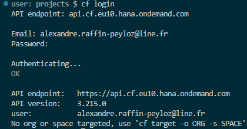
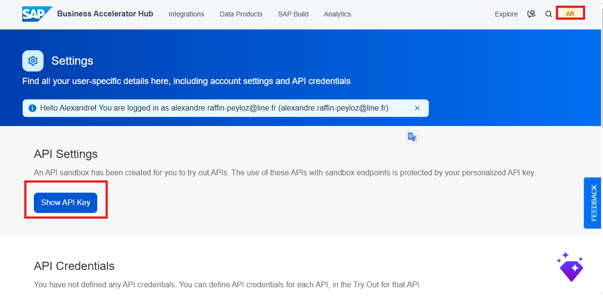

# Hands-on Tutorial 3 - Joule Studio & CAP App

Ici on modifiera l'application pour ne plus utiliser les mocks-data mais aller taper sur le S/4 via les destinations.

Element complexe => à bien documenter !

## Objectives
Switch from mock data to real S/4HANA data using BTP destionation 
Understand how to merge a Joule Agents and Skills with CAP/Fiori application
Explore and reseach about posibilities and use case on merging this 2 activities

## Introduction

Pendant le Hackthon il sera compliqué de réaliser cette partie du au manque de temps.
Partie exploratoire, exploratrise et non trivial, mais très pertienente
Imaginer et "drafter" des use cases et scénarios où les agents 

## Steps


## 1. Switch from mock data to real S/4HANA data using BTP destination 
Through the first hands-on tutorial, we created a functional CAP application based on our functional specifications. However, this one uses mock data, which is very good for a first version expressing our needs. But we must now "connect" it to our S/4HANA.


un modèle hybride (Mashup) !!
entité Vendors contient des données "Maîtres" (nom, pays) qui viennent de S/4HANA, mais aussi des données "Locales/Transactionnelles" (blockingStatus, pendingAction, et tes associations vers ActionLog).

0. Create a new branch

We start by creating a new branch "feature". This allow you to don't destroy your current project if something goes wrong. We could remove this branch without losing all your project and progress and without having to raise several commits.

```bash
$ git branch feature
$ git checkout feature
```

1. Get the edmx file
2. Importer API with CAP
```bash
$ cds import API_BUSINESS_PARTNER.edmx
```

This command do that : 
- Create the folder srv/external
- Introduce the file API_BUSINESS_PARTNER.csn
- Automatically updates the package.json

Faire de même pour le Purchase Order et Supplier Invoice

Modifier le package.json


```bash
$ cf login
```

Mettre où trouver l'api endpoint

```bash
$ cf create-service xsuaa application sandbox-xsuaa
$ cf create-service destination lite sandbox-destination

$ cds bind -2 sandbox-destination,sandbox-xsuaa

$ cds watch --profile hybrid
```

export S4_SANDBOX=true
unset S4_SANDBOX

cds deploy --to sqlite

3. Adapt data models (shema.cds & service.cds)


4. Write the interception logic (service.js)

## 2. Add Joule on the CAP application 


## Try to trigger the aggent using prompts


A mettre à part :


**Multi-language**


fBLxIlAkhO7qcXjYXoykH3xKp3TaAhju

