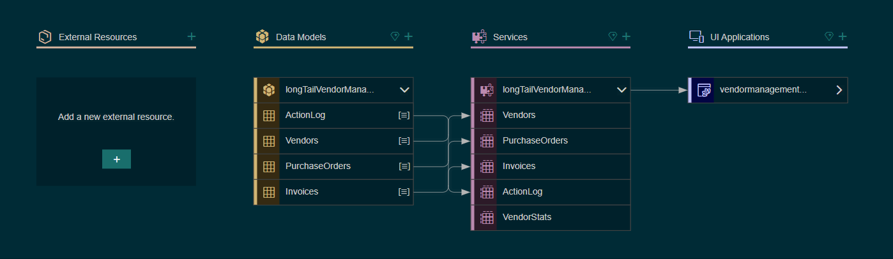
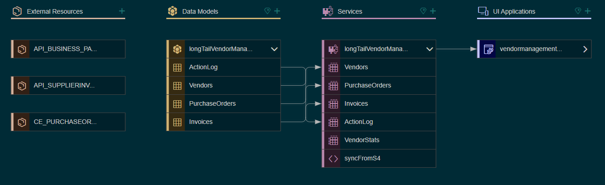
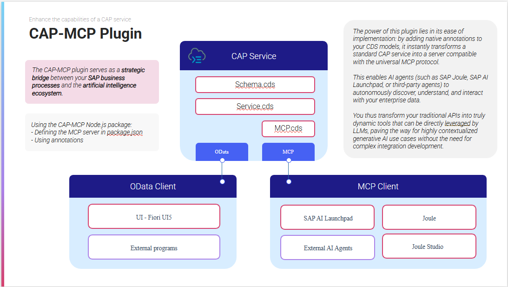
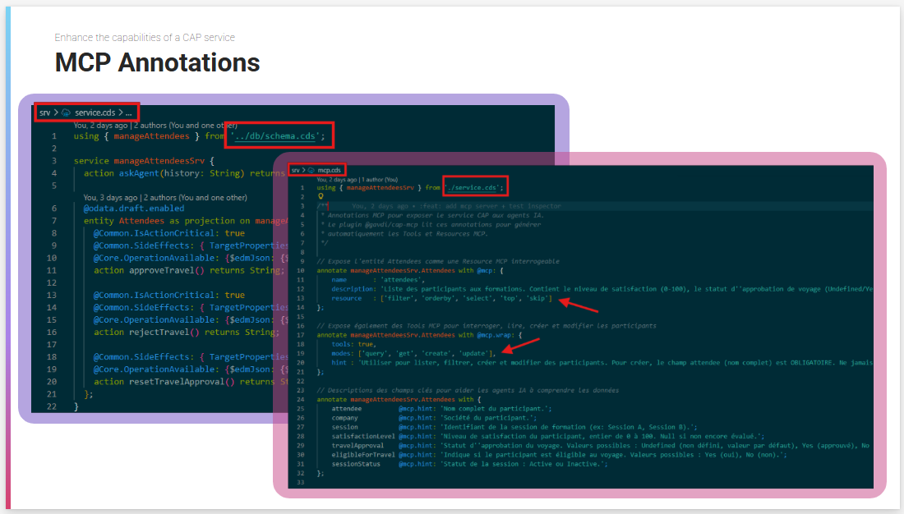
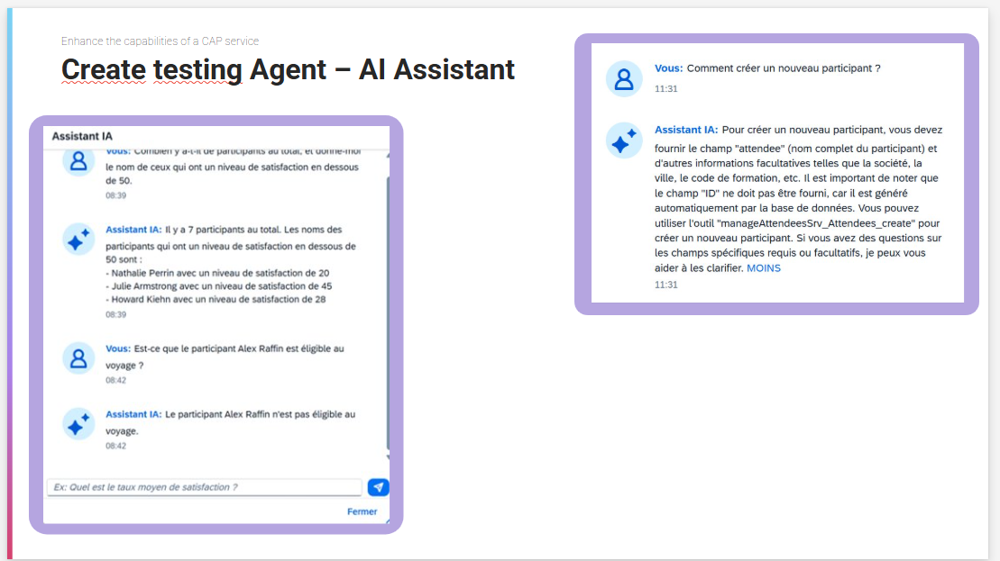

# Hands-on Tutorial 3 - Joule Studio & CAP App

## Introduction

During the Hackathon, you were able to create a CAP Fiori application, agents, skills, explore Joule Studio, the AI agents.

Through this third hands-on tutorial, you will adjust and refine everything while trying to integrate the two works together. Depending on the time remaining during the workshop, this part can be addressed and discussed but not completed because it is much more complex to implement.

## Objectives
- Switch from mock data to real S/4HANA data using BTP destionation 
- Understand how to merge a Joule Agents and Skills with CAP/Fiori application
- Explore and reseach about posibilities and use case on merging this 2 activities

---

## Table of Contents
1. [Switch from mock data to real S/4HANA data using BTP destination](#1-switch-from-mock-data-to-real-s4hana-data-using-btp-destination)
2. [Joule & CAP — Bridging Two Worlds](#2-joule--cap--bridging-two-worlds)
3. [Conclusion](#3-conclusion)

--- 

## 1. Switch from mock data to real S/4HANA data using BTP destination 
Through the first hands-on tutorial, we created a functional CAP application based on our functional specifications. However, this one uses mock data, which is very good for a first version expressing our needs. But we must now "connect" it to our S/4HANA.



The idea now is to avoid using these test data to connect your application to an S/4HANA system and understand this implementation. In this step-by-step tutorial, we will set up a connection to 3 sandbox.

**0. Create a new branch**

We start by creating a new branch "feature". This allow you to don't destroy your current project if something goes wrong. We could remove this branch without losing all your project and progress and without having to raise several commits.

```bash
$ git branch feature
$ git checkout feature
```

**1. Get the edmx file**

**2. Import API with CAP**

**3. Adapt data models (shema.cds & service.cds)**

**4. Write the interception logic (service.js)**



> You can find [a detailed guide on this integration](documentations/integration-guide-s4hana.md).

> ![NOTE]
> Do not hesitate to use Claude Code for the code modifications of step 3 and 4, and ask him to plan and study this implementation according to your environment.

---
 
## 2. Joule & CAP — Bridging Two Worlds
 
Now that your CAP application is connected to real S/4HANA data, you have a solid, production-grade foundation. In parallel, you've built Joule Agents and Skills capable of performing diagnostics, risk analysis, and actions on Business Partners.
 
**The natural question is: can these two work together?**
 
This section is intentionally different from the previous ones. Rather than providing a single predefined path to follow, it invites you to **explore, research, and experiment**. There is no unique correct answer — only trade-offs and hypotheses to test. This is the spirit of a hackathon: given what you've built, how far can you push the integration?
 
> **Mindset for this section**: You have two working systems. Your goal is to design the bridge between them — and there are several ways to build that bridge.
 
---
 
### 2.1 The Big Picture — What Are We Trying to Achieve?
 
Before diving into technical options, let's take a step back and frame the problem visually.
 
You currently have two separate artifacts:
 
```
┌─────────────────────────────┐     ┌──────────────────────────────┐
│   CAP / Fiori Application   │     │     Joule Studio             │
│                             │     │                              │
│  • Business Partner entity  │     │  • Supplier Risk Agent       │
│  • OData service exposed    │     │  • Diagnostic Skill          │
│  • Fiori Elements UI        │     │  • Block Supplier Skill      │
│  • Real S/4HANA data (↑)    │     │  • Natural language chat     │
└─────────────────────────────┘     └──────────────────────────────┘
```
 
The goal of this section is to explore how to connect these two artifacts so that the AI capabilities of Joule enrich the CAP application — and vice versa.
 
There are multiple ways to imagine this connection. Let's explore them.
 
---
 
### 2.2 The Possibilities
 
You can imagine several integration patterns, each answering a different question:
 
| # | Approach | Core Question |
|---|----------|--------------|
| **A** | Joule Skills consuming the CAP service as a data source | *Can Joule call my CAP OData endpoints through Actions?* |
| **B** | AI button in Fiori → CAP → GenAI Hub (SAP AI SDK) | *Can I embed an AI action directly inside my Fiori app?* |
| **C** | Joule Web Client Plugin in the Fiori Launchpad | *Can I surface the Joule chat icon inside my own launchpad?* |
| **D** | Custom MCP Server pointing to the CAP service | *Can I extend Joule Studio with my own CAP tools?* |
 
> ![TIP]
> **Hackathon tip**: Approaches A and B are complementary and can be explored in parallel by two sub-teams. Approaches C and D are more experimental — ideal if you've already completed A or B and want to go further.
 
### 2.3 Going Further — Research Spotlight: The CAP-MCP Plugin

> *"What if your CAP service could become a native AI tool — without writing a single line of integration code?"*

We also want to highlight a research discovery that reframes our way of thinking about the relationship between CAP and AI agents, and the possibilities for integrating AI agents, assistants, etc. into a business domain.

While preparing this tutorial, we came across a community plugin called **[`cap-mcp-plugin`](https://github.com/gavdilabs/cap-mcp-plugin)** by gavdilabs. It is a good example of how fast the SAP developer ecosystem is moving in the AI space — and of the kind of exploration that a hackathon is the perfect place for.

---

#### What Is It?

The CAP-MCP plugin acts as a **strategic bridge between your CAP service and the AI ecosystem**. By adding a few native CDS annotations to your existing `service.cds` and a dedicated `mcp.cds` file, it instantly transforms your standard CAP service into an **MCP-compatible server** (Model Context Protocol).

This means any MCP-capable AI agent — including Joule, SAP AI Launchpad, or external agents — can autonomously discover, understand, and interact with your enterprise data, without you having to build a custom integration layer.



Your CAP service continues to expose its standard OData interface to Fiori UI5. Simultaneously, it now exposes an MCP interface that AI agents can consume as native tools. Same service, two protocols, zero duplication.

---

#### How Does It Work?

The implementation is annotation-driven — which makes it very natural for anyone already comfortable with CDS.

You create a dedicated `mcp.cds` file alongside your existing `service.cds`:

```cds
// srv/mcp.cds
using { BusinessPartnerSrv } from './service.cds';

// Expose the entity as a queryable MCP Resource
annotate BusinessPartnerSrv.BusinessPartners with @mcp: {
  name        : 'businessPartners',
  description : 'List of Business Partners with risk score and block status.',
  resource    : ['filter', 'orderby', 'select', 'top', 'skip']
};

// Expose MCP Tools for reading and writing
annotate BusinessPartnerSrv.BusinessPartners with @mcp.wrap: {
  tools : true,
  modes : ['query', 'get', 'create', 'update'],
  hint  : 'Use this tool to list, filter, and manage Business Partners. The name field is mandatory for creation.'
};

// Field-level hints to help the AI understand your data
annotate BusinessPartnerSrv.BusinessPartners with {
  name         @mcp.hint: 'Full name of the Business Partner.';
  country      @mcp.hint: 'Country code of the supplier (e.g. DE, FR, US).';
  riskScore    @mcp.hint: 'Risk score from 0 to 100. Above 70 is considered high risk.';
  blocked      @mcp.hint: 'Indicates whether the supplier is currently blocked. Values: true or false.';
}
```

The plugin reads these annotations at runtime and automatically generates the MCP Tools and Resources — no additional server code required.



---

#### The Result — An AI Assistant Grounded in Your Data

Once the plugin is active, an AI agent connected via MCP can answer questions like:

- *"How many Business Partners have a risk score above 70?"*
- *"Is supplier Alex Raffin eligible for the next purchasing cycle?"*
- *"List all blocked German suppliers ordered by risk score."*

The agent calls the generated MCP tools directly, fetches live data from your CAP service, and formulates a natural language response — all without any prompt engineering or custom API wiring on your side.



---

#### Why This Matters

This approach elegantly solves one of the core challenges of AI integration in enterprise systems: **making structured business data understandable to an LLM without duplicating or re-exposing it**.

Instead of writing a dedicated integration layer for each AI consumer, you annotate your data model once. The field-level `@mcp.hint` annotations act as inline semantic documentation — telling the AI not just *what* a field contains, but *what it means in business terms*. This is the difference between an AI that can query your data and one that can reason about it.

It also illustrates a broader trend: the boundary between application development and AI agent development is dissolving. A well-designed CAP service, annotated thoughtfully, is already halfway to being an AI-native application.

---

#### Feasibility Note

This plugin is a **community project, still maturing**. For the purposes of this hackathon, it is presented as a research finding rather than a guided exercise — the configuration constraints and deployment setup go beyond what we can reliably cover in the available time.

That said, if your team is curious and has the time, it is absolutely worth exploring. The annotation approach is familiar, the GitHub repository contains working examples, and the potential payoff — a CAP service natively consumable by Joule or any MCP agent — is significant.

> **Plugin repository**: [github.com/gavdilabs/cap-mcp-plugin](https://github.com/gavdilabs/cap-mcp-plugin)

## 3. Conclusion

Throughout this hackathon, you explored two of the most concrete ways GenAI is reshaping SAP development: using AI coding agents to scaffold and build a full CAP/Fiori application, then designing Joule Skills and Agents to automate real business operations on your Business Partners.

This third tutorial was intentionally different and was not meant to be completed — it was meant to be read, discussed, and imagined. It opens a third dimension: what happens when you connect these two worlds? The integration of Joule into a CAP application, the idea of an AI assistant grounded in live S/4HANA data, a CAP service becoming natively consumable by any AI agent through MCP annotations — these are not distant concepts. They are already technically within reach, and the use cases they unlock are significant: intelligent supplier diagnostics, conversational access to enterprise data, AI-assisted decision-making embedded directly into your business processes.

The goal here was to give you a map of the possibilities, so that when the right opportunity arises — a client need, an internal initiative, a future hackathon — you already know what directions exist and where to start.

---
 
*Guide version 1.0 — Adapted for Hackathon GenAI For Dev Workshops - SAP x Line | 2026*

*Author: Line*

<div align="left">
  <a href="https://www.line-technologies.com/">
    
  </a>
  &nbsp;&nbsp;&nbsp;&nbsp;&nbsp;&nbsp;&nbsp;&nbsp; <a href="https://www.sap.com">
  
  </a>
</div>